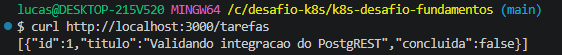
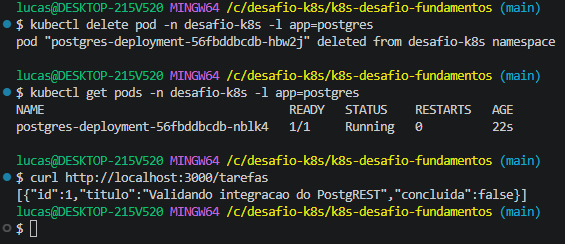
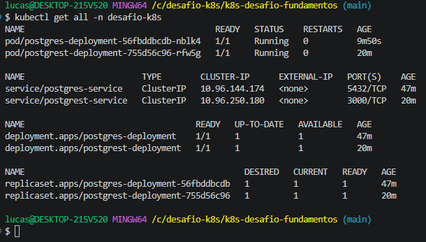

# k8s-desafio-fundamentos

Repositório com os manifests declarativos e documentação do desafio prático de orquestração de contêineres com Kubernetes.

## 🛠 Ferramenta Utilizada
* **Docker Desktop** (com Kubernetes local / kind integrado)
* **kubectl** para gerenciamento de recursos
* **Banco de Dados:** PostgreSQL 16 (`postgres:16`)
* **API REST:** PostgREST (`postgrest/postgrest`)
* **Cliente HTTP / Testes:** `curl`

---

# 🚀 Nível 1: Namespace e Primeiro Contato

### 1. Criação do Namespace
Para isolar todos os recursos da aplicação, criação de um namespace dedicado:

```bash
kubectl apply -f k8s/00-namespace.yaml

#Subi um pod temporário para exercutar comandos básicos de inspeção e ciclo de vida:

# Execução do pod temporário
kubectl run pod-teste --image=busybox -n desafio-k8s -- sleep 3600

# Inspeção e verificação
kubectl get pods -n desafio-k8s
kubectl describe pod pod-teste -n desafio-k8s
kubectl logs pod-teste -n desafio-k8s

# Limpeza
kubectl delete pod pod-teste -n desafio-k8s

```

## Reflexão:

Não. Um Pod avulso criado diretamente pelo comando kubectl run não possui nenhum controlador de réplica monitorando o seu estado desejado. Uma vez deletado, seu ciclo de vida é encerrado definitivamente. Por essa razão, em ambientes de produção raramente criamos Pods avulsos, recorrendo a Deployments para garantir auto-recuperação e alta disponibilidade.

# 💾 Níveis 2 e 3: Banco de Dados, Persistência e Configuração

### Objetivo da Camada de Dados
Implantar a base de dados PostgreSQL (`postgres:16`) garantindo a persistência física dos dados, comunicação interna estável via Service (`ClusterIP`) e o desacoplamento seguro das credenciais e parâmetros operacionais através de `Secret` e `ConfigMap`.

---

### Manifestos e Responsabilidades

* **`k8s/01-pvc.yaml` (Armazenamento Persistente):** Aloca 1Gi de espaço em disco via `PersistentVolumeClaim` (modo `ReadWriteOnce`), garantindo que o diretório de dados do banco sobreviva à recriação de Pods.
* **`k8s/02-secret.yaml` (Credenciais Sensíveis):** Armazena o usuário, senha do banco e a string de conexão (`PGRST_DB_URI`), evitando senhas fixas (*hardcoded*) nos manifests.
* **`k8s/03-configmap.yaml` (Parâmetros Operacionais):** Define configurações não sensíveis, como a porta padrão de rede e roles do schema.
* **`k8s/04-postgres.yaml` (Carga de Trabalho e Rede):** Deployment do banco de dados montando o PVC em /var/lib/postgresql/data e Service ClusterIP na porta 5432.
* **`k8s/05-postgrest.yaml`:** Deployment da API PostgREST com livenessProbe, readinessProbe, requests/limits e Service ClusterIP na porta 3000.
---

### Aplicação e Validação dos Recursos

```bash
# 1. Aplicar volumes, segredos e configurações
kubectl apply -f k8s/01-pvc.yaml
kubectl apply -f k8s/02-secret.yaml
kubectl apply -f k8s/03-configmap.yaml

# 2. Subir o Deployment e Service do PostgreSQL
kubectl apply -f k8s/04-postgres.yaml

# 3. Conferência do estado dos recursos
kubectl get pvc -n desafio-k8s
kubectl get secret,configmap -n desafio-k8s
kubectl get pods,svc -l app=postgres -n desafio-k8s

```

## Reflexão Nível 2:

emptyDir: O volume é criado diretamente no nó onde o Pod é instanciado e tem seu ciclo de vida estritamente acoplado ao Pod. Se o Pod for deletado, travar ou for recriado em outro nó, todo o conteúdo do diretório é destruído de forma irrecuperável.   

PersistentVolumeClaim (PVC): O volume é um recurso independente que abstrai o armazenamento persistente. Caso o Pod seja deletado ou sofra um crash, os arquivos do banco de dados continuam gravados no disco; assim que o Kubernetes recria o Pod pelo Deployment, o volume é reanexado ao caminho, mantendo tabelas e registros íntegros.

## Reflexão Nível 3:

Trata-se apenas de codificação em Base64, e não de criptografia. Qualquer pessoa ou processo com permissão de leitura (get secret) no cluster consegue recuperar a senha original instantaneamente usando echo <valor> | base64 -d.

Significado prático para a segurança: O objeto Secret padrão serve para evitar senhas expostas em texto plano no Git ou em telas de terminal durante revisões. Para segurança real em ambientes produtivos, é obrigatório aplicar políticas rígidas de RBAC, habilitar a encriptação em repouso (Encryption at Rest) no etcd e integrar o cluster com cofres de chaves externos (ex.: AWS Secrets Manager, HashiCorp Vault ou External Secrets Operator).

# 🌐 Nível 4: A API Conectada ao Banco (A Integração)

### Objetivo
Implantar a API dinâmica PostgREST (`postgrest/postgrest`) gerenciada por um `Deployment`, conectando-se ao PostgreSQL através da resolução interna de nomes do cluster (`CoreDNS` via Service `postgres-service:5432`). Essa etapa valida a integração de ponta a ponta: ao criar uma tabela no banco relacional, os endpoints REST HTTP correspondentes tornam-se imediatamente funcionais.

---

### Manifestos e Recursos Utilizados
* **Estrutura Relacional:** Criação da tabela `tarefas` no banco `appdb` via `kubectl exec`.
* **`k8s/05-postgrest.yaml`:**
  * `Deployment`: executa a imagem `postgrest/postgrest`, consumindo a connection string `PGRST_DB_URI` injetada a partir do `Secret` (`postgres-secret`) e os esquemas a partir do `ConfigMap` (`postgres-config`).
  * `Service`: abstração `ClusterIP` expondo a porta HTTP `3000` para consumo interno da API.

---

### Comandos de Aplicação e Teste

```bash
# 1. Criação da tabela tarefas no banco de dados via Pod do PostgreSQL
kubectl exec -i $(kubectl get pod -n desafio-k8s -l app=postgres -o jsonpath='{.items[0].metadata.name}') -n desafio-k8s -- psql -U devuser -d appdb -c "CREATE TABLE IF NOT EXISTS tarefas (id SERIAL PRIMARY KEY, titulo TEXT NOT NULL, concluida BOOLEAN DEFAULT FALSE);"

# 2. Aplicação do Deployment e Service da API PostgREST
kubectl apply -f k8s/05-postgrest.yaml

# 3. Verificação do status do Pod e Service
kubectl get pods,svc -l app=postgrest -n desafio-k8s

# 4. Encaminhamento de portas local para teste de integração
kubectl port-forward svc/postgrest-service 3000:3000 -n desafio-k8s

# 5. Inserção de registro via HTTP POST (executado em outro terminal)
curl -X POST http://localhost:3000/tarefas \
  -H "Content-Type: application/json" \
  -d '{"titulo": "Validando integracao do PostgREST"}'

# 6. Leitura e validação dos dados retornados pelo banco via HTTP GET
curl http://localhost:3000/tarefas

```

Primeira evidência:


## Reflexão Nível 4:

Utilizado o nome do Service do PostgreSQL na string de conexão porque os Pods no Kubernetes possuem ciclo de vida efêmero e recebem novos endereços IP dinâmicos a cada recriação ou reinicialização. Se a API fosse configurada apontando diretamente para o IP interno do Pod, qualquer oscilação ou falha do banco quebraria a comunicação da aplicação de forma definitiva. O Service resolve esse acoplamento ao registrar uma entrada estável no DNS interno do cluster (CoreDNS), funcionando como um ponto de acesso virtual fixo que descobre e roteia o tráfego automaticamente para a réplica ativa do banco de dados, o que assegura a resiliência e a disponibilidade da integração mesmo após a destruição do Pod.

# 🚀 Nível 5: Expor a API e Provar a Persistência (O Coração do Desafio)

### Objetivo
Acessar a API de fora do cluster utilizando encaminhamento de portas (`port-forward`), inserir e consultar dados via requisições HTTP (`POST`/`GET`), e comprovar que os registros sobrevivem à exclusão forçada do Pod do PostgreSQL graças ao desacoplamento provido pelo `PersistentVolumeClaim` (PVC).

---

### Procedimento de Execução e Testes

```bash
# 1. Expor a API localmente via port-forward (manter ativo em um terminal dedicado)
kubectl port-forward svc/postgrest-service 3000:3000 -n desafio-k8s

# 2. Inserir um registro no banco através da rota REST via POST (em outro terminal)
curl -X POST http://localhost:3000/tarefas \
  -H "Content-Type: application/json" \
  -d '{"titulo": "Validando integracao do PostgREST"}'

# 3. Consultar os dados persistidos via GET
curl http://localhost:3000/tarefas

# 4. Simulação de falha: Deletar forçadamente o Pod ativo do banco de dados
kubectl delete pod -n desafio-k8s -l app=postgres

# 5. Acompanhar a auto-recuperação: o Deployment sobe um novo Pod automaticamente
kubectl get pods -n desafio-k8s -l app=postgres

# 6. Provar a persistência: consultar a API novamente após o novo Pod atingir 'Running'
curl http://localhost:3000/tarefas

```

Segunda evidência:


## Reflexão Nível 5:

A retenção e disponibilidade contínua do dado exigiram a atuação conjunta e orquestrada de cinco componentes principais: o PersistentVolumeClaim (PVC), que manteve os blocos de dados físicos salvos no disco independentemente do ciclo de vida do contêiner; o Deployment do PostgreSQL, cujo controlador detectou a exclusão da réplica e instanciou imediatamente um novo Pod para cumprir o estado desejado (desired state); o Secret e o ConfigMap, que injetaram de forma transparente as credenciais e variáveis operacionais no novo contêiner sem intervenção humana; o Service do PostgreSQL, que atualizou dinamicamente sua tabela interna de endpoints apontando para o IP do novo Pod; e a camada do PostgREST (Deployment e Service), que continuou em execução e restabeleceu a comunicação via DNS interno sem travar a aplicação.

# ⚖️ Nível 6: Health Checks e Escala

### Objetivo
Ensinar o cluster a monitorar ativamente a integridade da API PostgREST por meio de sondas de saúde (`livenessProbe` e `readinessProbe`), definir o consumo computacional com `requests` e `limits` de CPU e memória, e observar o balanceamento de carga do `Service` ao escalar horizontalmente o número de réplicas da aplicação.

---

### Manifestos e Recursos
* **Configuração no `k8s/05-postgrest.yaml`:**
  * **`livenessProbe`:** Realiza checagens HTTP periódicas na rota `/` (porta `3000`) para validar se o processo continua ativo e responsivo.
  * **`readinessProbe`:** Avalia se o contêiner está apto a receber requisições externas antes de liberá-lo nos endpoints do `Service`.
  * **`resources`:** Delimita a alocação de recursos do Pod (ex.: `requests` de 50m de CPU / 64Mi de memória e `limits` de 150m de CPU / 128Mi de memória).

---

### Procedimento de Execução e Escala

```bash
# 1. Escalar manualmente o Deployment da API para 3 réplicas
kubectl scale deployment postgrest-deployment --replicas=3 -n desafio-k8s

# 2. Acompanhar a inicialização e aprovação dos Pods pelas probes de saúde
kubectl get pods -n desafio-k8s -l app=postgrest

# 3. Inspecionar o balanceamento: verificar os múltiplos IPs registrados no Service
kubectl get endpoints postgrest-service -n desafio-k8s

# 4. Inspecionar as probes e limites configurados em um dos Pods
kubectl describe pod -n desafio-k8s -l app=postgrest

```

## Reflexão Nível 6:

A diferença fundamental reside na reação do Kubernetes a falhas: a livenessProbe identifica se o contêiner travou ou entrou em estado irrecuperável e força sua reinicialização física, enquanto a readinessProbe apenas sinaliza se o contêiner está pronto para atender tráfego — se falhar, o Pod não é reiniciado, apenas temporariamente retirado da rota de balanceamento do Service para evitar que requisições de clientes resultem em falha de conexão. Em relação à escalabilidade, a API PostgREST é stateless (sem estado), o que significa que qualquer réplica processa requisições HTTP de maneira isolada e intercambiável, permitindo o balanceamento seguro de carga. Em contrapartida, o PostgreSQL é uma aplicação stateful (com estado) que realiza controle rígido de escrita direta em estruturas de arquivos no disco; subir múltiplas réplicas compartilhando o mesmo PVC com o modo de acesso padrão (ReadWriteOnce) provocaria bloqueios de montagem de volume ou corrupção catastrófica e irreversível da integridade dos dados relacionais.

Terceira evidência:


Para remover todos os recursos alocados e liberar a capacidade do cluster:

```Bash
kubectl delete namespace desafio-k8s

```


